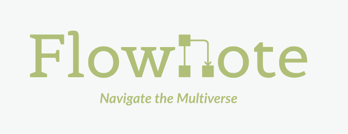
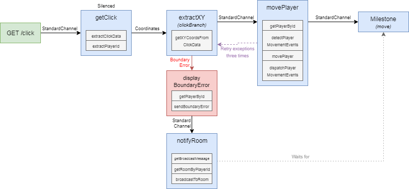

FlowNote is a programming language designed to help reason about and represent flow-based paradigms.

## _Getting Started_

### Installation

`npm install flownote`

### Example

```javascript
import {
  Application,
  Flow,
  StandardNode,
  StandardChannel,
  Action
} from 'flownote'

const app = new Application(undefined, 'Test App', {
  logLevel: 3
})

const doubleXAction = new Action(app, undefined, 'doubleX', function doubleX () {
  this.set('x', this.get('x') * 2)
})

const halveXAction = new Action(app, undefined, 'halveX', function halveX () {
  this.set('x', this.get('x') / 2)
})

const addXAndYAction = new Action(app, undefined, 'addXAndY', function addXAndY () {
  this.set('x', this.get('x') + this.get('y'))
})

const subtractXFromYAction = new Action(app, undefined, 'subtractXFromY', function subtractXFromY () {
  this.set('y', this.get('x') - this.get('y'))
})

app.registerAction(doubleXAction.name, doubleXAction)
app.registerAction(halveXAction.name, halveXAction)
app.registerAction(addXAndYAction.name, addXAndYAction)
app.registerAction(subtractXFromYAction.name, subtractXFromYAction)

const flow = new Flow(app, undefined, 'Test Flow', {}, undefined, 'GET', '/testFlow', [ 'x', 'y' ])
app.setPublicFlow(flow)

const doubleXNode = new StandardNode(app, undefined, 'Double X', [], [], [ app.getAction('doubleX') ])
const channelA = new StandardChannel(app, undefined, 'Channel', undefined, [], undefined, [])
const addXAndYNode = new StandardNode(app, undefined, 'Add X and Y', [], [], [ app.getAction('addXAndY') ])
const channelB = new StandardChannel(app, undefined, 'Channel', undefined, [], undefined, [])
const halveXNode = new StandardNode(app, undefined, 'Add X and Y', [], [], [ app.getAction('halveX') ])
const channelC = new StandardChannel(app, undefined, 'Channel', undefined, [], undefined, [])
const subtractXFromYNode = new StandardNode(app, undefined, 'Add X and Y', [], [], [ app.getAction('subtractXFromY') ])

flow.connect(doubleXNode)
doubleXNode.connect(channelA)
channelA.connect(addXAndYNode)
addXAndYNode.connect(channelB)
channelB.connect(halveXNode)
halveXNode.connect(channelC)
channelC.connect(subtractXFromYNode)

const result = await app.request('GET', '/testFlow', {
  x: 2,
  y: 10
})
```

To see more isolated examples, check out the [flowExamples.js](tests/flowExamples.js) test.

## _Concepts_

### Application

Applications contain Flows (which represent your business logic.) and an Event Queue (for Event progression).

### Flows

Flows contain Nodes and Milestones that are connected together via Channels. Flows can also connect to Flows to maximize reuse of business logic.

### Event Queue

The Event Queue receives Events from Nodes, Milestones, and Channels and properly executes the Actions within each.

### Actions

Actions are individual axioms about your business rules.  Within an action, you can `dispatch` Event progression, `set` and `get` values to a Request, `schedule` Actions to perform at a Milestone, and `waitFor` Nodes, Channels, and/or Milestones to process an Event.  Each Node, Channel, or Milestone can have one or more Actions that will be sequentially executed when an Event is passed between them.

### Nodes

Nodes contain Actions and connect to one or more Channels. Node Actions are responsible for explicitly `dispatch`ing events for intended Channels. Node Actions can fire `dispatch` multiple times per execution, initiating a parallel Event progression through a Flow. Node Actions can also `schedule` future Actions for Milestones.

### Milestones

Milestones will execute all of their Actions and any Actions that have been `schedule`d prior to the Milestone. Once all `schedule`d Actions are executed, the schedule will be emptied.  It is HIGHLY recommended to `schedule` future Actions in previous Node Actions that are related to retrieving or committing information to persistent and/or non-idempotent services.  If you don't do this, you will experience difficult-to-reverse transactional situations during parallel processing. Like Nodes, Milestones also connect to one or more Channels and are responsible for their own `dispatch`ing.

### Channels

Channels are how information is passed between Nodes and Milestones. They accept specific events to manage Event progression. If a Node or Milestone throws an error and the preceding Channel had retry options set, the failed Event will be retried upon the exception-throwing Node or Milestone a number of times according to those options. Channels can also have one or more Actions.

## _Features_

### Output Emission

When a Request is started, a Request is finished, a Flow is started, a Flow has reached an end, a Node/Milestone/Channel Action is being run, a Request variable is `change`d, or an Error is thrown, a JSON object about that Event is printed to the Application's output/error streams. This is designed primarily for Unity or other render-only platforms to have total transparency into the lifecycle of a FlowNote process.

### Error Pathing

If a Node or Milestone throws an error, `ErrorChannel`s can be imported and `connect`ed to determine which Node or Milestone handles the error. That error path can be reconnected with future Nodes in the flow as well. It's also possible that a Node or Milestone can throw an error and engage in intended Event progression as well.

### Event Delegation

To prevent memory leaks, `EventEmitter` is not used. Instead, we use `SetImmediate` as the core of our Event Queue.

### JSON Hydration

FlowNote is designed to represent an Application as a pure state machine.  This means the Application can be reduced down to a JSON object and be fully restored at any given time. This means the Application object, the Event Queue and all pending Events, all Flows and their Nodes, Channels, and Milestones (even if they are self-referential or eventually circularly connected), and all code that makes up all Actions are representable as a JSON. That JSON can be transmitted to child threads/processes or external resources for scalable processing. This can be incredibly useful for debugging, testing, snapshots, scaling, and versioning.

### Parallel Processing

FlowNote naturally allows for parallel processing and has a useful feature to prevent deadlocking. Actions can use `waitFor` to delay Event progression until other Nodes, Channels, or Milestones execute. If the target had already executed for that Request, `waitFor` will progress, otherwise, it will wait until that target executes.

### Request History

Within Actions, variables of the Request can be `set` or `get`. Instead of overwriting values, `set` commits the value to the Request and which Application, Flow, and Node/Channel/Milestone initiated the `set`. Additionally, the Request keeps track of which path it took through a Flow. This is incredibly useful for debugging and other activities for render clients.  The full history of `set` commits can be boiled down to a single Object with unique keys via the Request's `getState()`.

### Cyclical Detection

If you accidentally connect Nodes, Milestones, in a Channel that results in a cyclical loop, FlowNote will detect it and throw a `CyclicalError`.

### Profiling

FlowNote uses [Clinic](https://clinicjs.org/) to perform profiling. You can run a profile with `npm run profiler` for a simple overview and `npm run profiler-explorer` for a comprehensive profile breakdown.

### Custom Streaming

By default, Applications receive input from  `stdin` and emit all Events progression to `stdout` and `stderr` accordingly.  Custom streams can passed into the Application's constructor. Input data events are passed to the callback set with `setOnInput()`. When the input strean closes, the callback passed into `setOnShutdown()` will fire. You have to manually activate input stream listening with a call to `listen()`. To stop taking input stream events, use `unlisten()`

### HTTP Server Integration

Applications initiate requests into Flows with the `request(httpMethod, httpRoute, parameters)` method. which will pass a request through the corresponding Flow. To simplify usage, Application instances can pass their `httpRequestHandler` method into any `http.createServer()` method and HTTP requests will map to Flows according to their method and route definitions.  HTTP GET queries are converted into parameters automatically.

### Browser-Friendly

FlowNote can be ran in the browser as well! Go [here](https://htmlpreview.github.io/?https://github.com/Emblem21-OpenSource/flownote/blob/master/dist/index.html) and checkout the console and network tabs! If you'd like to test out the browser builds locally, run `npm run browser-test` and open `http://localhost:1000`.

### Domain Specific Language

FlowNote is designed to bring the linguistic part of our brains to help reason about and design flow-based programming tasks.  As a result, it has grammar. It's currently experimental, so check back later.  To generate the following Flow:



... you can use the following code:

```javascript
// Allow access to all Nodes, Flows, and named Instances from customNodes.flow
import 'custom.flow'

// Create Nodes that execute a series of Actions
node getClick = extractClickData, extractPlayerId
node extractXY = getXYCoordsFromClickData
node movePlayer = getPlayerById, detectPlayerMovementEvents, movePlayer, dispatchPlayerMovementEvents
node displayBoundaryError = getPlayerById, sendBoundaryError
node notifyRoom = getBroadcastMessage, getRoomByPlayerId, broadcastToRoom

// Create a Flow that can be accessed via GET /click
// The getClick Node has been silenced ($) and will not emit events.
// getClick connects via a StandardChannel (->) to an extractXY Node.
// The extractXY Node is given an instance name of "clickBranch"
flow click(GET /click) = getClick$ -> extractXY#clickBranch

// Using the "clickBranch" instance name, we attach a Coordinates Channel (-Coordinates>) to the extractXY Node within the click Flow.
// Then we connect the Coordinates Channel to a movePlayer Node and allow the Channel to retry exceptions from movePlayer three times.
// The movePlayer Node is given an instance name of "move".
// The movePlayer also will have a Milestone after it to commit all accumulated Actions.
clickBranch -Coordinates{ retry: 3 }> movePlayer*#move

// Using the "clickBranch" instance name, we attach an ErrorChannel (-ErrorChannel!) to the extractXY Node within the click Flow that accepts BoundaryErrors.
// Attach a displayError to the ErrorChannel.
clickBranch -BoundaryError! displayBoundaryError

// Using the "clickBranch" instance name, we attach a notifyRoom node to the extractXY in the click Flow via a StandardChannel. (->)
// Ensure that notifyRoom waits (...) for the movePlayer Node within the click Flow to complete before performing its actions.
clickBranch -> notifyRoom ... move

```

In nine lines of code, we can orchestrate multiple functions together with retry functionality, error handling, sane transactional persistence, and expose them for usage very easily. As a Request moves through Nodes and Channels and Milestones and its values are `set`, the output stream of the Application will emit JSONs of all Event Progression.

To compile FlowNote files, you can do the following:

##### As Command

`./compile <path to .flow file>`

##### As Pipe

`cat <path to .flow file> | ./compile`

##### As Code

```javascript
import { Compiler } from 'flownote'

const complier = new Compiler()

const contents = 'node Test = Action1,Action2,Action3' // Actual FlowNote code
const application1 = await compiler.compile(contents)

const filepath = '~/test.flow' // Path to the .flow file 
const application2 = await compiler.compileFromFile(filepath)
```

#### Behavior Driven-Design

Additionally, FlowNote allows for Behavior Driven-Design grammar as well to allow non-developer conceptualization of how an app should world. This is an example of English BDD:

```
GetClick Node is ExtractClickData and ExtractPlayerId
ExtractXY Node is GetXYCoordsFromClickData
MovePlayer Node is GetPlayerById, DetectPlayerMovementEvents, MovePlayer and DispatchPlayerMovementEvents
DisplayBoundaryError Node is GetPlayerById and SendBoundaryError
NotifyRoom Node is GetBroadcastMessage, GetRoomByPlayerId and BroadcastToRoom

Click Flow (GET /click) is a silent GetClick that connects to ExtractXY (as ClickBranch)
ClickBranch connects with Coordinates to MovePlayer (as Move) then commits
ClickBranch errors with BoundaryError to DisplayBoundaryError
ClickBranch connects to NotifyRoom but waits for Move
```

Right now, this functionality does not work, but it's coming soon!

## _Future_

* Allow alternative Event Queues to be utilized.
* Allow Event retries to have a programmatic number of attempts.
* Allow Event retries to have programmatic delays for throttling compliance.
* Allow for endpoints and Requests to specify what data they return. (State, variable history, and flow navigation)
* Allow HTTP handler to throw 404s.
* Allow HTTP POST requests to convert their body into parameters.
* Improve performance by dealing with the limits of setImmediate.
* Create the English BDD grammar
* Build basic library of common Actions that integrate into popular services.
* Provide robust documentation designed for onboarding.
* Integrate announcement of line coverage for tests
* Setup Dockerfile

## _Developing_

When you're ready to submit pull requests, make sure you create a new branch off of the most recent tag (`git checkout -b <nameOfYourBranch> <version>`), modify your code, run `npm version patch`, then push the commit.

## _Porting_

For those interested in porting FlowNote to another language, here are the dependencies that are optional:

* Node [v8.11.1](https://nodejs.org/en/blog/release/v8.11.1/): Host language
* Colors [v1.2.0-rc0](https://github.com/Marak/colors.js/tree/v1.2.0-rc0): Cross-terminal coloring tool
* ESM [v3.2.10](https://github.com/standard-things/esm/tree/3.2.10): Easy import/export support
* Fast Safe Stringify [v2.0.6](https://github.com/davidmarkclements/fast-safe-stringify/tree/v2.0.6): Fast JSON representation (Event emissions)
* ClinicJS [v4.0.0](https://github.com/nearform/node-clinic/tree/v4.0.0): Profiling tool

These dependencies are needed and will also have to be ported or be given similar alternatives:

* Ohm [v0.14.0](https://github.com/harc/ohm/tree/v0.14.0): Parser, lexer, and compiler
* Flatted [v2.0.0](https://github.com/WebReflection/flatted/tree/v2.0.0): Safely represents and restores circular JSON (Application snapshots)
* HyperID [v1.4.1](https://github.com/mcollina/hyperid/tree/ad1ccf743358ed6d79fad9ffbbf470645f8da612): Fast GUID generation