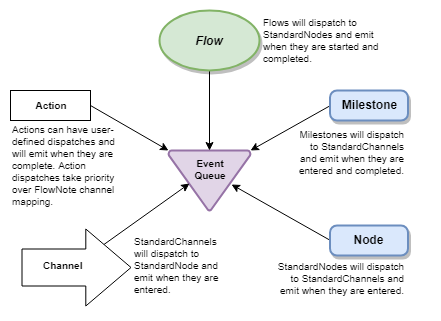

# The Application Concept

FlowNote Applications organize business logic as Flows and Actions.  

## Basic Concepts

* Applications are a collection of Actions and Flows.
* [Flows](06-flow.md) are HTTP-compliant Endpoints and have a collection of Nodes, Channels, and Milestones.
* When a Flow Eendpoint is requested, Events are created and move between Nodes, Milestones, and Channels.
* [Nodes](07-nodes.md) and Milestones have a sequential list of Actions and pass Events to Channels.
* [Channels](08-channels.md) can be configured for retry strategies and pass Events to Nodes and Milestones.
* [Actions](07-nodes.md#Actions) contain user-defined JavaScript and can perform useful operations.
* [Milestones](07-nodes.md#Milestones) commit all accumulated scheduled Actions in the order they were scheduled. (Calls to 3rd party services or resources, etc)

## Event Queue

An Application has an Event Queue that manages the progression of Events through a Flow.  By default, FlowNote Applications use the [MemoryQueue](../src/queues/memoryQueue.js), but you can also create wrappers for custom queues such as Redis, ZeroMQ, or queuing services by registering it with call to the Application's  [`registerQueueType(<name of the queue type>, <Your new Queue Class>)`](https://github.com/Emblem21-OpenSource/flownote/blob/e6457d6b406104cdf3c98eaa276537c9852bc6dd/src/eventQueue.js#L11)

## Examples

To see more various examples of how Applications are defined, check out the [flowExamples.js](../tests/flowExamples.js) test.

##### Documentation

( 
[Installation](01-installation.md) | 
[Features](02-features.md) | 
[Use Cases](03-use-cases.md) | 
[Language](04-language.md) | 
Application | 
[Flow](06-flow.md) | 
[Nodes](07-nodes.md) | 
[Channels](08-channels.md) | 
[Contribution Overview](09-contribution.md) | 
[Roadmap](10-roadmap.md) | 
[Known Problems](11-known-problems.md)
)