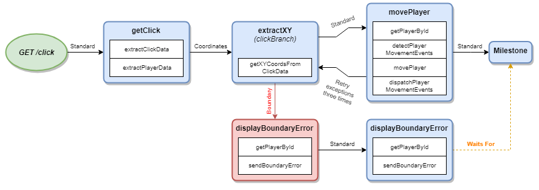

# The Flow Concept

Flows contain Nodes and Milestones that are connected together via Channels. Flows can also connect to Flows to maximize reuse of business logic.

## Configuring

* `showState` will show the consolidated state of all transformations that applied to the Request when `request.asResult` is called.
* `showTrace` will show all transitions between Nodes, Milestones, and Channels the Request made when `request.asResult` is called.
* `showChanges` will show all changes made to the Request when `request.asResult` is called.

## Examples

Coming soon!

##### Documentation

( 
[Installation](01-installation.md) | 
[Features](02-features.md) | 
[Use Cases](03-use-cases.md) | 
[Language](04-language.md) | 
[Application](05-application.md) | 
Flow | 
[Nodes](07-nodes.md) | 
[Channels](08-channels.md) | 
[Contribution Overview](09-contribution.md) | 
[Roadmap](10-roadmap.md) | 
[Known Problems](11-known-problems.md)
)