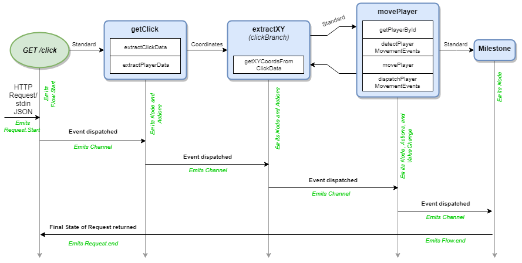

# The Flow Concept

Flows contain Nodes and Milestones that are connected together via Channels. Flows can also connect to Flows to maximize reuse of business logic. Flows have a HTTP-compliant Endpoint that can be requested.  
Here's an example of a Flow handling a Request across as timeline as it passes events between its Nodes and Channels:

Once requested, an Event will be passed to the first Node in the Flow. The Node will run its Actions and, based on the outcome, will either pass a new Event to its connected Channels, throw an Exception, or do neither. Channels will receive Events and pass them along to the Node it is connected to.  This process completes until the last Node in a Flow completes its final Action.  At this point, the pending Request will return the state of the Request to the client.  All the while, each transaction across Nodes, Channels, and state changes will be emitted as lifecycle information. (The green, italic text in the image above)

## Configuring A Flow

* `showState` will show the consolidated state of all transformations that applied to the Request when `request.asResult` is called.
* `showTrace` will show all transitions between Nodes, Milestones, and Channels the Request made when `request.asResult` is called.
* `showChanges` will show all changes made to the Request when `request.asResult` is called.

## Examples

Coming soon!

##### Documentation

( 
[Installation](01-installation.md) | 
[Features](02-features.md) | 
[Use Cases](03-use-cases.md) | 
[Language](04-language.md) | 
[Application](05-application.md) | 
Flow | 
[Nodes](07-nodes.md) | 
[Channels](08-channels.md) | 
[Contribution Overview](09-contribution.md) | 
[Roadmap](10-roadmap.md) | 
[Known Problems](11-known-problems.md)
)