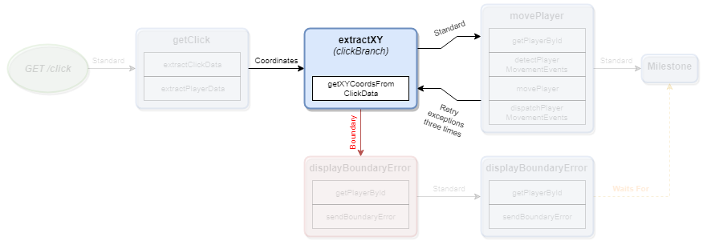

# The Node Concept

Nodes contain Actions and connect to one or more Channels.  They receive events from Channels and pass events to Channels.

## Actions

Actions are individual axioms about your business rules represented by JavaScript.  Within an action, you can do the following:

* `dispatch(eventName)`: Places an Event, by name, on the Event Queue.
* `set(key, value)`: Commits the value to the Request state based on the key.
* `get(key)`: Retrieves the current Request state based on the key.
* `toStore(name, key, value)`: Sets the value to the named store based on the key.
* `fromStore(name, key)`: Retrieves the keyed value from the name store.
* `schedule(action, strategy)`: Schedules an Action to be processed at the next Milestone.
* `waitFor(stepId, callback)`: Tells the Node to dispatch Channel events only when the step specified by the `stepId` has finished.

If a Node or Milestone has multiple Actions, they will be executed in sequence.  Each time an Action is ran, lifecycle information about that information is emitted.

## Milestones

Milestones will execute all of their Actions and any Actions that have been `schedule`d prior to the Milestone. Once all `schedule`d Actions are executed, the schedule will be emptied.  It is HIGHLY recommended to `schedule` future Actions in previous Node Actions that are related to retrieving or committing information to persistent and/or non-idempotent services.  If you don't do this, you will experience difficult-to-reverse transactional situations during parallel processing. Like Nodes, Milestones also connect to one or more Channels and are responsible for their own `dispatch`ing.

### Context

Coming soon!

## Examples

Coming soon!

##### Documentation

( 
[Installation](01-installation.md) | 
[Features](02-features.md) | 
[Use Cases](03-use-cases.md) | 
[Language](04-language.md) | 
[Application](05-application.md) | 
[Flow](06-flow.md) | 
Nodes | 
[Channels](08-channels.md) | 
[Contribution Overview](09-contribution.md) | 
[Roadmap](10-roadmap.md) | 
[Known Problems](11-known-problems.md)
)