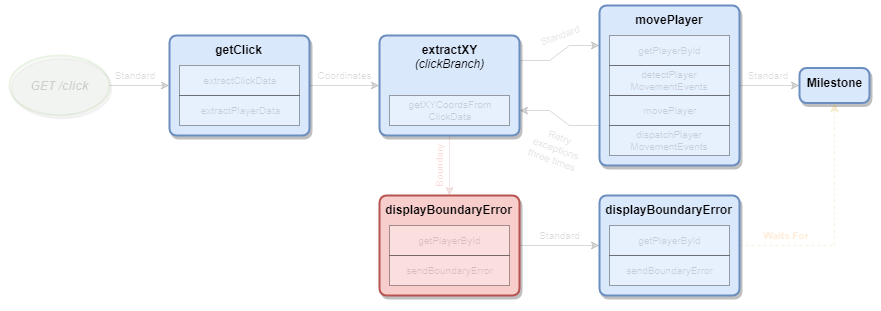
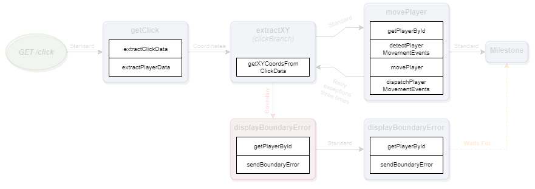

# The Node Concept

Nodes contain Actions and connect to one or more Channels.  They receive events from Channels and pass events to Channels.

## Actions

Actions are individual axioms about your business rules represented by JavaScript.  Within an action, you can do the following:

* `dispatch(eventName)`: Places an Event, by name, on the Event Queue.
* `set(key, value)`: Commits the value to the Request state based on the key.
* `get(key)`: Retrieves the current Request state based on the key.
* `toStore(name, key, value)`: Sets the value to the named store based on the key.
* `fromStore(name, key)`: Retrieves the keyed value from the name store.
* `schedule(action, strategy)`: Schedules an Action to be processed at the next Milestone.
* `waitFor(stepId, callback)`: Tells the Node to dispatch Channel events only when the step specified by the `stepId` has finished.

If a Node or Milestone has multiple Actions, they will be executed in sequence.  Each time an Action is ran, lifecycle information about that information is emitted.

## Milestones

Milestones will execute all `schedule`d Actions that have been accumulated.  Scheduled actions will be executed in the order they have been scheduled.  Once those Actions are completed, the Request will have no more Scheduled actions pending.  It is **HIGHLY** recommended to `schedule` Actions that are related to retrieving or committing information to persistent, remote, and/or non-idempotent services.  If you don't do this, you will experience difficult-to-reverse transactional situations during parallel processing or random order of exeuction during sequential processing. Like Nodes, Milestones also connect to one or more Channels.

## Examples

* [This action](https://github.com/Emblem21-OpenSource/flownote/blob/8957b98d719b2b0339e38006708156d493f951ce/tests/flowExamples.js#L24) doubles the value of *x*.
* [This action](https://github.com/Emblem21-OpenSource/flownote/blob/8957b98d719b2b0339e38006708156d493f951ce/tests/flowExamples.js#L51) will wait 1000 milliseconds before multiplying *y* by 10.
* [This action](https://github.com/Emblem21-OpenSource/flownote/blob/8957b98d719b2b0339e38006708156d493f951ce/tests/flowExamples.js#L33) will set *y* equal to *x* minus from *y*.

##### Documentation

( 
[Installation](01-installation.md) | 
[Features](02-features.md) | 
[Use Cases](03-use-cases.md) | 
[Language](04-language.md) | 
[Application](05-application.md) | 
[Flow](06-flow.md) | 
Nodes | 
[Channels](08-channels.md) | 
[Contribution Overview](09-contribution.md) | 
[Roadmap](10-roadmap.md) | 
[Known Problems](11-known-problems.md)
)