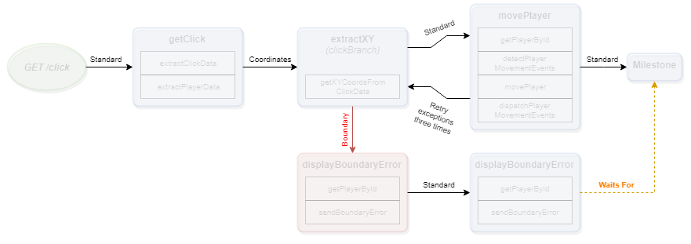

# The Channel Concept



Channels are how Events are passed between Nodes and Milestones. Channels can be made to accept specificly named Events so you can control how Requests move through a flow.

If a Node or Milestone throws an exception and the preceding Channel had retry options set, the failed Event will be retried from its initial state a number times and with delays based on those options.  When the retry options are exhausted, an Error Event will be sent to all connected Error Channels.

## Retry options

* `retry`  can be a number of retries to attempt or a string of an Action name to use to generate a number of retries.returns a number.
* `retryDelay` can be a number of milliseconds to wait between retry attempts or a string of an Action name to use to generate a millisecond number.

## FlowNote

This defines a Flow as a Node connecting to another Node.

```java
flow example(GET /example) = someNode -> anotherNode
```

This defines a Flow as a Node connecting to another Node with a custom reference.  The referenced Node is then attached to the last Node.

```java
flow example(GET /example) = someNode -> anotherNode#customReference
customReference -> lastNode
```

This defines a Flow as a Node connecting to another Node with a custom reference.  The referenced Node is then attached to the last Node via an Error Channel (!) that listens for `RangeErrors`.

Channel names can only be letters, numbers, or periods.

```java
flow example(GET /example) = someNode -> anotherNode#customReference
customReference -RangeError! lastNode
```

This defines a Flow as a Node connecting to another Node with a custom reference.  The referenced Node is then attached to the last Node via an Named Channel that listens for `Named` events.

```java
flow example(GET /example) = someNode -> anotherNode#customReference
customReference -NamedChannel> lastNode
```

This defines a Flow as a Node connecting to another Node with a custom reference.  The referenced Node is then attached to the last Node with retry options.

```java
flow example(GET /example) = someNode -> anotherNode#customReference
customReference -{ retry: 3, retryDelay: 3000 }> lastNode
```

This defines a Flow as a Node connecting to another Node with a custom reference.  The referenced Node is then attached to the last Node with retry options set by returned results of an Action.

```java
flow example(GET /example) = someNode -> anotherNode#customReference
customReference -{ retry: someActionThatReturnsNumber, retryDelay: someActionThatReturnsMilliseconds }> lastNode
```

## Examples

* [Programmatic example](https://github.com/Emblem21-OpenSource/flownote/blob/8957b98d719b2b0339e38006708156d493f951ce/tests/flowExamples.js#L81) of a Standard Channel.
* [Programmatic example](https://github.com/Emblem21-OpenSource/flownote/blob/8957b98d719b2b0339e38006708156d493f951ce/tests/flowExamples.js#L163) of an Error Channel.
* [Programmatic example](https://github.com/Emblem21-OpenSource/flownote/blob/8957b98d719b2b0339e38006708156d493f951ce/tests/flowExamples.js#L227) of a Retry Channel.
* [Programmatic example](https://github.com/Emblem21-OpenSource/flownote/blob/8957b98d719b2b0339e38006708156d493f951ce/tests/flowExamples.js#L300) of a Retry Channel defined by the results of an Action.
* [FlowNote example](https://github.com/Emblem21-OpenSource/flownote/blob/8957b98d719b2b0339e38006708156d493f951ce/tests/flowExamples.js#L419) of a Standard Channel.
* [FlowNote example](https://github.com/Emblem21-OpenSource/flownote/blob/8957b98d719b2b0339e38006708156d493f951ce/tests/flowExamples.js#L423) of an Error Channel.
* [FlowNote example](https://github.com/Emblem21-OpenSource/flownote/blob/8957b98d719b2b0339e38006708156d493f951ce/tests/flowExamples.js#L421) of a Retry Channel.

##### Documentation

( 
[Installation](01-installation.md) | 
[Features](02-features.md) | 
[Use Cases](03-use-cases.md) | 
[Language](04-language.md) | 
[Application](05-application.md) | 
[Flow](06-flow.md) | 
[Nodes](07-nodes.md) | 
Channels | 
[Contribution Overview](09-contribution.md) | 
[Roadmap](10-roadmap.md) | 
[Known Problems](11-known-problems.md)
)