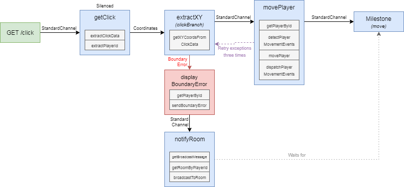

# FlowNote Language

FlowNote is designed to bring the linguistic part of our brains to help reason about and design flow-based programming tasks.  As a result, it has grammar. It's currently experimental, so check back later.  To generate the following Flow:



This graph can be represented via the following FlowNote code:

```java
// Allow access to all Nodes, Flows, and named Instances from customNodes.flow
import 'custom.flow'

// Create Nodes that execute a series of Actions
node getClick = extractClickData, extractPlayerId
node extractXY = getXYCoordsFromClickData
node movePlayer = getPlayerById, detectPlayerMovementEvents, movePlayer, dispatchPlayerMovementEvents
node displayBoundaryError = getPlayerById, sendBoundaryError
node notifyRoom = getBroadcastMessage, getRoomByPlayerId, broadcastToRoom

// Create a Flow that can be accessed via GET /click
// The getClick Node has been silenced ($) and will not emit events.
// getClick connects via a StandardChannel (->) to an extractXY Node.
// The extractXY Node is given an instance name of "clickBranch"
flow click(GET /click) = getClick$ -> extractXY#clickBranch

// Using the "clickBranch" instance name, we attach a Coordinates Channel (-Coordinates>) to the extractXY Node within the click Flow.
// Then we connect the Coordinates Channel to a movePlayer Node and allow the Channel to retry exceptions from movePlayer three times.
// The movePlayer Node is given an instance name of "move".
// The movePlayer also will have a Milestone after it to commit all accumulated Actions.
clickBranch -Coordinates{ retry: 3 }> movePlayer*#move

// Using the "clickBranch" instance name, we attach an ErrorChannel (-ErrorChannel!) to the extractXY Node within the click Flow that accepts BoundaryErrors.
// Attach a displayError to the ErrorChannel.
clickBranch -BoundaryError! displayBoundaryError

// Using the "clickBranch" instance name, we attach a notifyRoom node to the extractXY in the click Flow via a StandardChannel. (->)
// Ensure that notifyRoom waits (...) for the movePlayer Node within the click Flow to complete before performing its actions.
clickBranch -> notifyRoom ... move

```

In nine lines of code, we can orchestrate multiple functions together with retry functionality, error handling, sane transactional persistence, and expose them for usage very easily. As a Request moves through Nodes and Channels and Milestones and its values are `set`, the output stream of the Application will emit JSONs of all Event Progression.

##### Behavior Driven-Design (Coming soon!)

Additionally, FlowNote allows for Behavior Driven-Design grammar as well to allow non-developer conceptualization of how an app should world. This is an example of English BDD:

```java
GetClick Node is ExtractClickData and ExtractPlayerId
ExtractXY Node is GetXYCoordsFromClickData
MovePlayer Node is GetPlayerById, DetectPlayerMovementEvents, MovePlayer and DispatchPlayerMovementEvents
DisplayBoundaryError Node is GetPlayerById and SendBoundaryError
NotifyRoom Node is GetBroadcastMessage, GetRoomByPlayerId and BroadcastToRoom

Click Flow (GET /click) is a silent GetClick that connects to ExtractXY (as ClickBranch)
ClickBranch connects with Coordinates to MovePlayer (as Move) then commits
ClickBranch errors with BoundaryError to DisplayBoundaryError
ClickBranch connects to NotifyRoom but waits for Move
```

## Compilation

To compile FlowNote files, you can do the following:

##### As Command

`./flownote compile <path to .flow file>`

##### As Pipe

`cat <path to .flow file> | ./flownote compile`

##### Within an NodeJS Project from a string

```javascript
import { Compiler } from 'flownote'

const complier = new Compiler()

const contents = 'node Test = Action1,Action2,Action3'
const application = await compiler.compile(contents)
```

##### Within a NodeJS Project from a file

```javascript
import { Compiler } from 'flownote'

const complier = new Compiler()

const filepath = '~/test.flow'
const application = await compiler.compileFromFile(filepath)
```

##### Within an Browser Project

```javascript
var complier = new FlowNote.Compiler()

var contents = 'node Test = Action1,Action2,Action3'

var application = compiler.compile(contents).then(function (application) {
  // Do things
})
```

##### Within a ReactJS Project (Coming soon!)

```javascript
import { Compiler } from 'flownote'

const complier = new Compiler()

const contents = 'node Test = Action1,Action2,Action3'
const application = await compiler.compile(filepath)
```

##### Documentation

( 
[Installation](01-installation.md) | 
[Features](07-features.md) | 
[Application](02-application.md) | 
[Flow](03-flow.md) | 
[Nodes](04-nodes.md) | 
[Channels](05-channels.md) | 
[Use Cases](06-use-cases.md) | 
Language | 
[Contribution Overview](09-contribution.md) | 
[Roadmap](10-roadmap.md) | 
[Known Problems](11-known-problems.md)
)